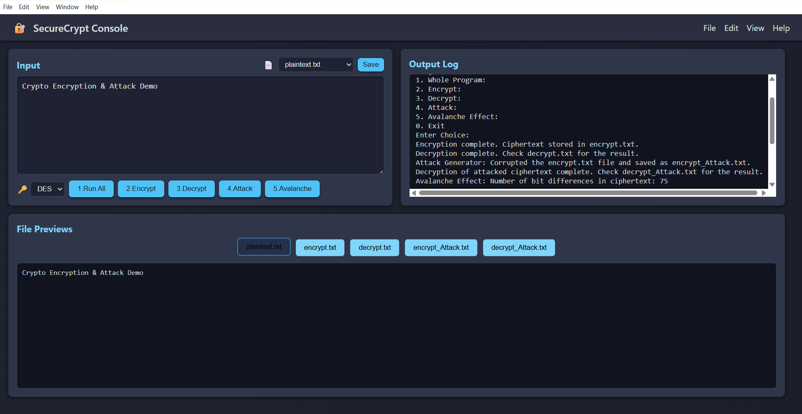
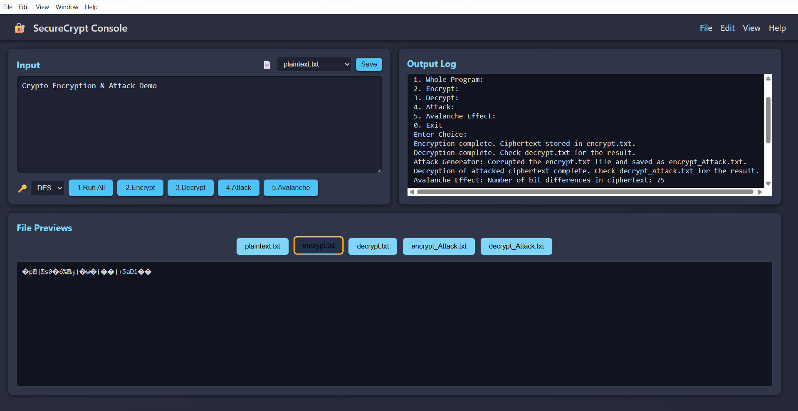
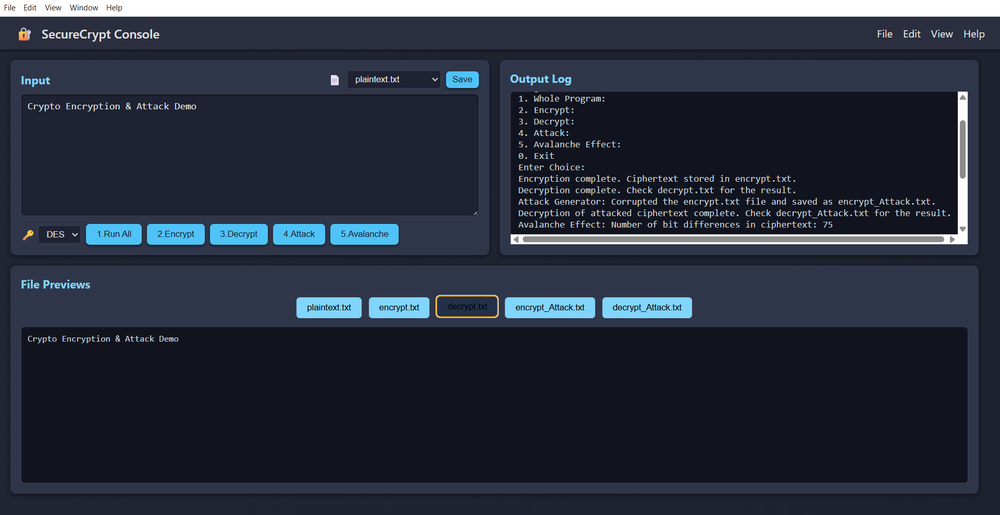
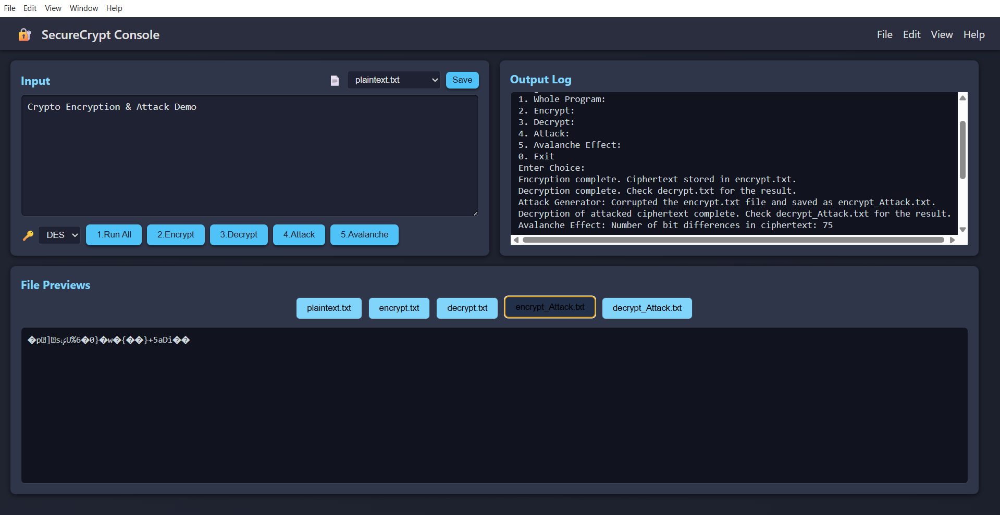

# 🔐 Crypto Encryption & Attack Demo

A fully interactive cryptographic simulation using **DES/AES**, complete with encryption, decryption, attack corruption, and avalanche effect — controlled via a stunning animated browser UI powered by Java + HTML + CSS + JavaScript.

---

## 📘 Description

This project is designed to demonstrate the **core principles of Information Security** using industry-standard encryption techniques and simulate both safe and unsafe data handling.

🔑 The program includes:
- **Encryption & Decryption** using **DES** and **AES**
- **File-level attack simulation** by altering ciphertext
- **Avalanche Effect Demonstration** — flip 1 bit, change many
- **Dynamic terminal-style logs**
- **Live file preview system** for `.txt` results
- All features wrapped in a clean, animated, and user-friendly UI

---

## 🎯 Key Features

### 🔣 Algorithm Selector
- Choose between `DES` or `AES` encryption algorithms

### 🧪 Core Actions (Buttons)
- `Run All`: Execute **encryption → decryption → attack → avalanche** in one go
- `Encrypt`: Encrypt input text and store into `encrypt.txt`
- `Decrypt`: Read and decrypt from `encrypt.txt`, store in `decrypt.txt`
- `Attack`: Randomly corrupt the encrypted data, simulate failed decryption
- `Avalanche`: Demonstrate how a single bit change causes widespread ciphertext change

### 📂 File Save & Preview
- **File Selector**: Choose where to save your input (`plaintext.txt`, etc.)
- **Live Preview Tabs**: See file contents from:
  - `plaintext.txt`
  - `encrypt.txt`
  - `decrypt.txt`
  - `encrypt_Attack.txt`
  - `decrypt_Attack.txt`

### 📜 Log Output
- Terminal-like panel showing all steps and algorithm results

---

## 🧰 Tech Stack

| Layer       | Technology                                            |
|-------------|--------------------------------------------------------|
| 🧠 Backend  | Java 11+ (`javax.crypto`, `KeyGenerator`, `Cipher`)    |
| 🖼 Frontend | HTML5 + CSS3 + Vanilla JavaScript                      |
| 🎨 Styling  | Fully custom dark theme, animated background           |
| ⚙️ Execution | Node.js (`fs`, `child_process`) to bridge to Java     |
| 🧩 Layout   | CSS Grid, Flexbox, media queries for responsiveness     |
| 💡 UX       | Hover effects, animations, preview tabs, and controls  |

---

## 📁 File Descriptions

| File Name              | Purpose                                                                 |
|------------------------|-------------------------------------------------------------------------|
| `Main.java`            | Java backend: DES/AES encryption, decryption, attack & avalanche logic |
| `index.html`           | Full frontend layout and button interface                              |
| `style.css`            | Custom CSS styles, themes, animations, layout                          |
| `app.js`               | Node.js logic to run Java, update UI, preview files                    |
| `plaintext.txt`        | Input text to encrypt                                                   |
| `encrypt.txt`          | Ciphertext (after encryption)                                           |
| `decrypt.txt`          | Result after decrypting `encrypt.txt`                                  |
| `encrypt_Attack.txt`   | Corrupted version of ciphertext (simulated attack)                     |
| `decrypt_Attack.txt`   | Result after decrypting the corrupted ciphertext                       |

---

## 🖼 Screenshots

### 🧩 UI Panel Layout

  
  
  
  

> *Each screenshot highlights different parts of the simulation, from encryption to attack results.*

---

## 📚 Educational Purpose

This project is made for:

- 🎓 **Students** learning cryptography and information security
- 🧑‍🏫 **Teachers** wanting to visually demonstrate encryption behavior
- 👨‍💻 **Developers** interested in Java crypto and frontend-crypto integration

### You will learn:

- 🔐 How encryption & decryption actually work (DES & AES)
- ❌ What happens when ciphertext is modified (attack/integrity breach)
- 🌪 How **Avalanche Effect** proves cryptographic diffusion
- 📁 How to use **real-world file-based encryption workflows**

## 👤 Author

Created by **Kaushal Ramoliya**  
📧 Email: [kaushalramoliya1@gmail.com](mailto:kaushalramoliya17@gmail.com)  
